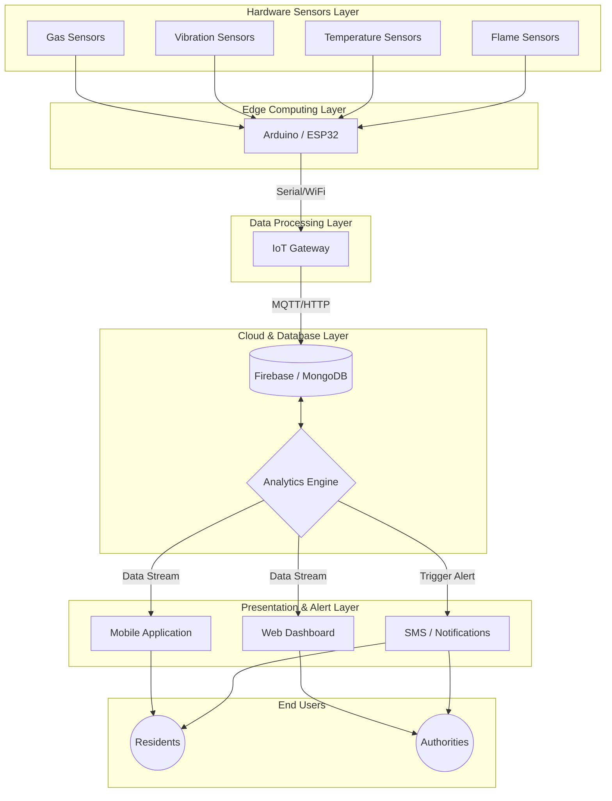
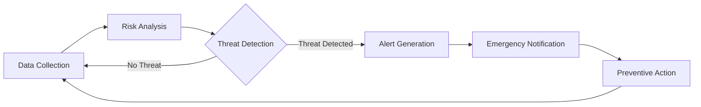

<div align="center">
  <!-- Project Logo Placeholder -->
  

  <h1>🚨 Sarva Suraksha System 🚨</h1>
  <p><strong>An IoT-enabled smart monitoring and early warning platform designed to protect civilians, residential buildings, and local authorities.</strong></p>

  <!-- Project Banner Placeholder -->
  

  <p>
    <a href="https://github.com/harshitmandal25/Sarva-Suraksha-System/stargazers"></a>
    <a href="https://github.com/harshitmandal25/Sarva-Suraksha-System/network/members"></a>
    <a href="https://github.com/harshitmandal25/Sarva-Suraksha-System/issues"></a>
    <a href="https://github.com/harshitmandal25/Sarva-Suraksha-System/blob/main/LICENSE"></a>
  </p>
  <p>
    
    
    
    
    
    
  </p>
</div>

<hr>

## 📋 Table of Contents
<details>
<summary>Click to expand</summary>

1. [Executive Summary](#-executive-summary)
2. [Problem Overview](#-problem-overview)
3. [Solution Overview](#-solution-overview)
4. [Key Features](#-key-features)
5. [System Architecture](#-system-architecture)
6. [Workflow Diagram](#-workflow-diagram)
7. [Hardware Components](#-hardware-components)
8. [Software Stack](#-software-stack)
9. [Folder Structure](#-folder-structure)
10. [Installation Guide](#-installation-guide)
11. [Usage Guide](#-usage-guide)
12. [Screenshots](#-screenshots)
13. [Future Scope](#-future-scope)
14. [Impact](#-impact)
15. [Team VisionX](#-team-visionx)
16. [License](#-license)
17. [Acknowledgements](#-acknowledgements)
18. [Contribution Guidelines](#-contribution-guidelines)
19. [Contact Information](#-contact-information)

</details>

---

## 🚀 Executive Summary

**Sarva Suraksha System** is a comprehensive, scalable smart-city safety solution designed to mitigate the risks associated with historical coal mining activities. Developed by **Team VisionX** from **GGSESTC, Bokaro**, this project focuses on continuous environmental and structural risk monitoring to provide early warnings and actionable insights to residents and local authorities. It acts as a critical lifeline for communities threatened by ground subsidence, coal fires, and toxic gas emissions.

---

## ⚠️ Problem Overview

The coal mining regions of Jharia and Dhanbad, Jharkhand, are plagued by an ongoing crisis due to improper and historical coal mining activities. The primary challenges include:

* 🔥 **Underground Coal Fires:** Uncontrollable fires that have been burning for over a century, weakening the ground structure.
* 🏚️ **Ground Subsidence:** Sudden collapse of land, leading to severe structural damage to residential buildings and public infrastructure.
* ☠️ **Toxic Gas Emissions:** Release of lethal gases like Carbon Monoxide (CO), Methane (CH4), and Sulfur Dioxide (SO2) from underground fires.
* 👨‍👩‍👧‍👦 **Civilian Impact:** Constant threat to life and property, respiratory health hazards, and forced displacements.

---

## 💡 Solution Overview

Sarva Suraksha System addresses these critical challenges by deploying an **IoT-enabled smart monitoring and early warning platform**. It continuously tracks environmental parameters and structural integrity indicators. By analyzing this data in real-time, the system generates early warning alerts, thereby protecting civilians, residential buildings, and local authorities, and facilitating timely emergency response.

---

## ✨ Key Features

* 📡 **Real-time Monitoring:** Continuous tracking of environmental and structural parameters.
* 🔔 **Early Warning Alerts:** Instant notifications via SMS/App/Buzzer when thresholds are breached.
* 🌬️ **Environmental Sensing:** Detection of toxic gases and temperature spikes.
* 🏢 **Structural Safety Monitoring:** Vibration analysis to detect impending ground subsidence or building collapse.
* 🌐 **IoT Integration:** Seamless data transmission to the cloud for real-time analysis.
* 🚑 **Emergency Response Support:** Automated alerts to local authorities and disaster management agencies.
* 📊 **Dashboard Analytics:** Comprehensive web dashboard for monitoring historical and real-time data.
* 📈 **Data Visualization:** Interactive charts and graphs for trend analysis.

---

## 🏗️ System Architecture



---

## ⚙️ Workflow Diagram



---

## 🛠️ Hardware Components

| Component | Purpose & Functionality |
| :--- | :--- |
| **Arduino/ESP32** | The brain of the system; processes sensor data and handles WiFi/serial communication. |
| **MQ Gas Sensors** | Detects toxic gases like Methane, Carbon Monoxide, and smoke emitted from underground fires. |
| **Vibration Sensor** | Monitors structural integrity and detects micro-tremors indicating ground subsidence. |
| **Temperature Sensor** | Measures ambient and surface temperature to identify heat signatures of underground fires. |
| **Flame Sensor** | Detects open flames or sudden fire outbreaks in the vicinity. |
| **GSM/WiFi Module** | Transmits collected data to the cloud and sends SMS alerts in emergencies. |
| **Buzzer** | Provides localized audible alarms to alert nearby residents immediately. |
| **LEDs** | Visual indicators for system status and danger levels (Green/Yellow/Red). |
| **Power Supply** | Ensures continuous operation of the IoT nodes (Battery/Solar/Adapter). |

---

## 💻 Software Stack

* **Embedded Programming:** Arduino IDE (C/C++)
* **Backend:** Node.js, Express.js, Python (for data analytics script)
* **Frontend:** React, JavaScript, HTML5, CSS3
* **Database:** Firebase Realtime Database / MongoDB
* **IoT Protocols:** MQTT, HTTP/HTTPS

---

## 📂 Folder Structure

```text
Sarva-Suraksha-System/
├── index.html
├── docs/
│   └── images/
│       ├── logo.png
│       ├── banner.png
│       ├── dashboard.png
│       ├── architecture.png
│       ├── workflow.png
│       └── prototype.png
└── README.md
```
*(Note: Structure will evolve as frontend, backend, and arduino code bases are added)*

---

## 🚀 Installation Guide

### Prerequisites
* Git installed
* Node.js & npm installed
* Arduino IDE installed

### Steps

1. **Clone the repository:**
   ```bash
   git clone https://github.com/harshitmandal25/Sarva-Suraksha-System.git
   cd Sarva-Suraksha-System
   ```

2. **Install dependencies:**
   *(Navigate to frontend/backend directories when they are added)*
   ```bash
   # Example for Node backend
   # cd backend
   # npm install
   ```

3. **Configure environment variables:**
   Create a `.env` file in the root of the backend/frontend directory and add necessary API keys (Firebase, DB URI, etc.).

4. **Upload Arduino code:**
   * Open the `.ino` file in the Arduino IDE.
   * Select your board (Arduino Uno / ESP32) and port.
   * Install required sensor libraries.
   * Click **Upload**.

5. **Start backend:**
   ```bash
   # cd backend
   # npm start
   ```

6. **Start frontend:**
   ```bash
   # cd frontend
   # npm start
   ```

---

## 📖 Usage Guide

1. Power on the hardware module and ensure it connects to the configured WiFi network.
2. Open the web dashboard in your browser.
3. Observe real-time sensor readings updating on the charts.
4. Simulate a hazard (e.g., use a lighter near the gas sensor) to trigger an alert.
5. Verify that the buzzer sounds, LEDs flash, and the dashboard reflects the critical status.
6. Check for emergency SMS/notifications if configured.

---

## 📸 Screenshots

### 1. Web Dashboard


### 2. System Architecture


### 3. Workflow


### 4. Hardware Prototype


---

## 🔮 Future Scope

* 🧠 **AI-based Risk Prediction:** Implementing Machine Learning models to predict subsidence and fire outbreaks based on historical data patterns.
* 🛰️ **Satellite Integration:** Combining ground sensor data with satellite imagery for macro-level subsidence monitoring.
* 🗺️ **GIS Mapping:** Integrating Geographic Information Systems (GIS) for precise mapping of vulnerable zones.
* 📱 **Mobile Application:** A dedicated app for residents to receive push notifications and view localized risk maps.
* 🏛️ **Government Disaster Networks:** API integration with existing state and national disaster management frameworks.
* 🌆 **Smart City Deployment:** Scaling the solution to be a standard safety feature in upcoming smart city projects in mining areas.

---

## 🌟 Impact

* **Residents:** Ensures peace of mind, early evacuation warnings, and protection of life and property.
* **Local Authorities:** Provides actionable data for urban planning, resource allocation, and disaster mitigation.
* **Mining Companies:** Helps in monitoring the environmental impact of operations and taking corrective measures.
* **Disaster Management Agencies:** Enhances response times and allows for targeted rescue operations during emergencies.
* **Government Bodies:** Aids in policy-making and long-term rehabilitation planning for affected regions.

---

## 👥 Team VisionX

**Institute:** Guru Gobind Singh Educational Society's Technical Campus (GGSESTC), Bokaro

| Name | Role | GitHub | LinkedIn |
| :--- | :--- | :--- | :--- |
| **[Contributor 1]** | Team Lead / Full Stack Developer | [@username](https://github.com/) | [Profile](https://linkedin.com/) |
| **[Contributor 2]** | IoT & Hardware Engineer | [@username](https://github.com/) | [Profile](https://linkedin.com/) |
| **[Contributor 3]** | Data Analyst / ML Engineer | [@username](https://github.com/) | [Profile](https://linkedin.com/) |
| **[Contributor 4]** | UI/UX Designer & Researcher | [@username](https://github.com/) | [Profile](https://linkedin.com/) |

---

## 📄 License

This project is licensed under the [MIT License](LICENSE) - see the LICENSE file for details.

---

## 🙏 Acknowledgements

We would like to express our deepest gratitude to:
* **GGSESTC, Bokaro** for providing the platform and resources.
* **Our Faculty Mentors** for their invaluable guidance and support throughout the project.
* **The Entire VisionX Team** for their relentless effort and dedication.
* **The Local Communities** of Jharia and Dhanbad whose resilience inspires our work.
* **Open-Source Contributors** whose libraries and tools made this project possible.

---

## 🤝 Contribution Guidelines

We welcome contributions from the community to make the Sarva Suraksha System better!

1. Fork the repository.
2. Create a new branch (`git checkout -b feature/AmazingFeature`).
3. Commit your changes (`git commit -m 'Add some AmazingFeature'`).
4. Push to the branch (`git push origin feature/AmazingFeature`).
5. Open a Pull Request.

Please read our [CONTRIBUTING.md](CONTRIBUTING.md) for details on our code of conduct, and the process for submitting pull requests to us.

---

## 📬 Contact Information

For any queries, collaborations, or feedback, feel free to reach out:

* **Email:** [harshitkirtiraj@gmail.com](mailto:harshitkirtiraj@gmail.com)
* **Project Link:** [https://harshitmandal25.github.io/sarva-suraksha-system/](https://harshitmandal25.github.io/sarva-suraksha-system/)

---
<div align="center">
  <i>Built with ❤️ by Team VisionX for a safer tomorrow.</i>
</div>
